# CI/CD Pipeline: Jenkins + GitHub Actions → ECS

The same build → test → security scan → push → deploy pipeline implemented
in both **Jenkins** and **GitHub Actions**, deploying a Flask app to Amazon
ECS Fargate behind an Application Load Balancer — all infrastructure
provisioned by Terraform with zero manual AWS setup.

Mirrors the CI/CD pipelines built for **30+ production applications**,
cutting release cycle time from days to hours.

## Problem

Manual deployments are slow and error-prone. Choosing one CI tool locks a
team in. A practitioner who understands pipeline patterns can implement them
in any tool — this project demonstrates that.

## Solution

### Infrastructure (`terraform-ecs-infra/`)
One `terraform apply` creates everything:
- VPC, subnets, Internet Gateway
- ECR repository with lifecycle policy (keeps last 10 images)
- ECS Fargate cluster with Container Insights
- IAM execution role + task role (least privilege)
- CloudWatch log group
- Application Load Balancer + Target Group + Listener
- ECS Task Definition + Service wired to ALB

### Pipeline stages (identical logic in both tools)
1. **Test** — pytest runs against the Flask app
2. **Build** — Docker image built from `app/Dockerfile`
3. **Security scan** — Trivy scans for CRITICAL CVEs (`--ignore-unfixed` skips unpatched upstream deferrals)
4. **Push** — image pushed to ECR with git SHA as tag
5. **Deploy** — downloads current task definition, swaps image tag, registers new revision, updates ECS service, waits for stability

### Jenkins automation (`jenkins-setup/setup-jenkins.sh`)
One script installs Jenkins, Java, Docker, AWS CLI v2, and Trivy on a fresh
Ubuntu EC2 — no manual steps.

## Architecture

```
GitHub push
    │
    ├──▶ GitHub Actions (deploy.yml)     Jenkins (Jenkinsfile)
    │         │                                │
    └─────────┴────────────────────────────────┘
                          │
              test → build → trivy scan → push ECR
                          │
              download task def → update image → register revision
                          │
                    ECS update-service
                          │
              ALB → ECS Fargate Tasks (private, ALB-only access)
```

## Tech Used

Jenkins · GitHub Actions · Docker · Trivy · Amazon ECR · Amazon ECS Fargate ·
ALB · Terraform · Flask · pytest

## Usage

```bash
# 1. Provision all infrastructure
cd terraform-ecs-infra
terraform init && terraform apply

# 2. Add GitHub Secrets (one-time)
# AWS_ACCESS_KEY_ID + AWS_SECRET_ACCESS_KEY

# 3. Push to main — pipeline runs automatically
git push origin main
```

## Proof of Deployment

### Terraform — all resources created
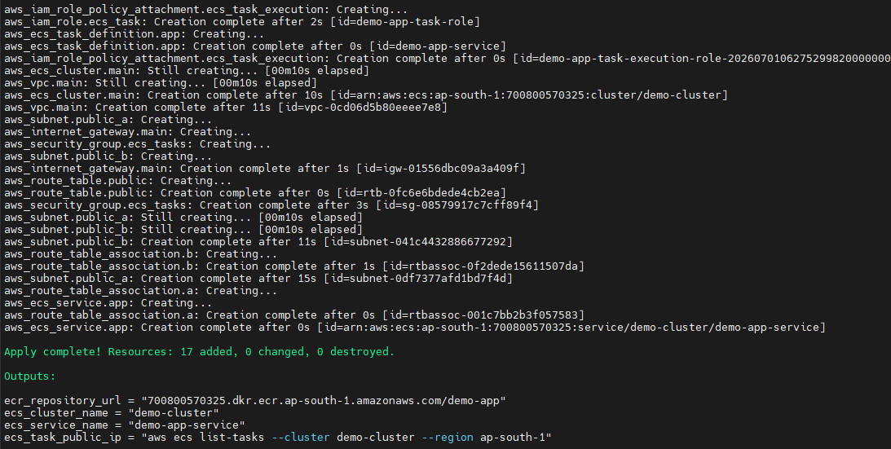

### GitHub Actions — pipeline completed with all stages green
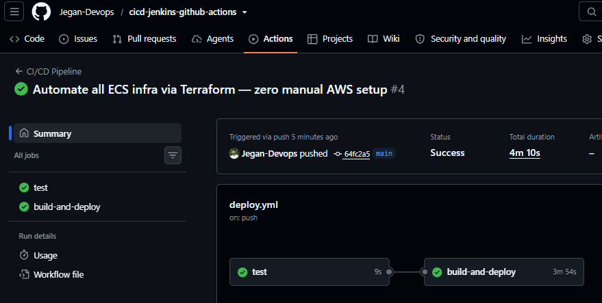

### GitHub Actions — detailed stage view
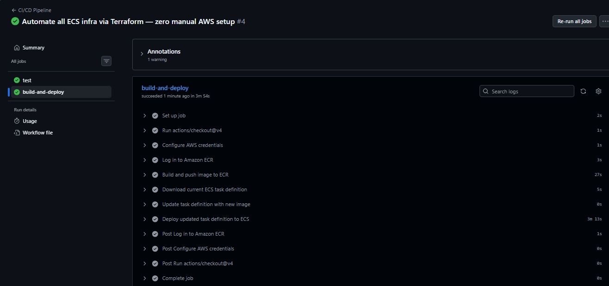

### Jenkins — triggered automatically by GitHub push (webhook)
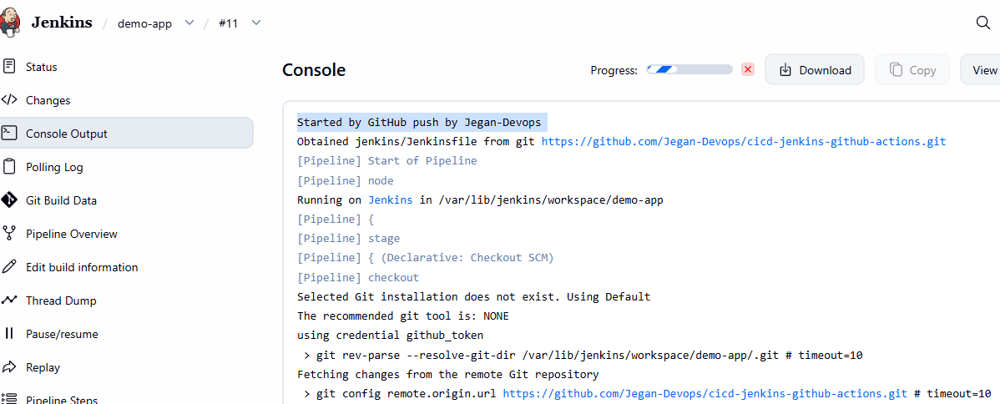

### Jenkins — pipeline completed with all stages
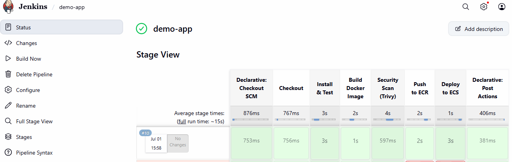

### ECR — Docker image pushed with git SHA tag
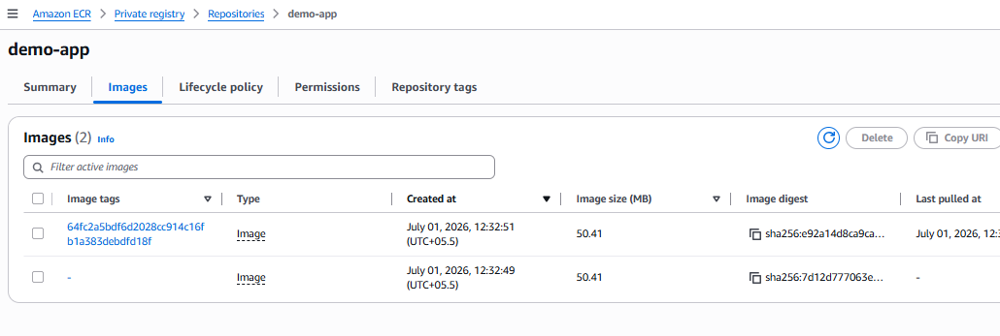

### ECS Cluster
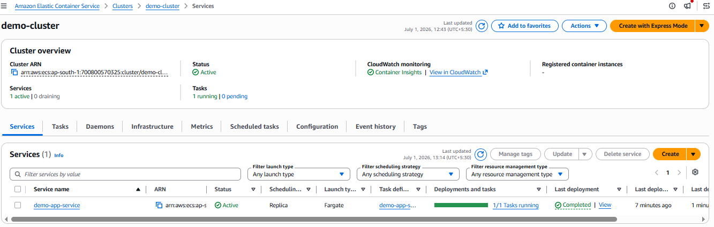

### ECS Service — tasks running and healthy
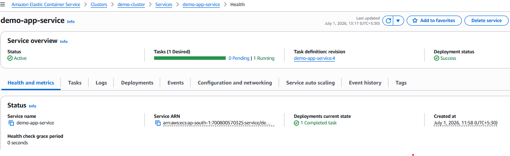

### ECS Tasks
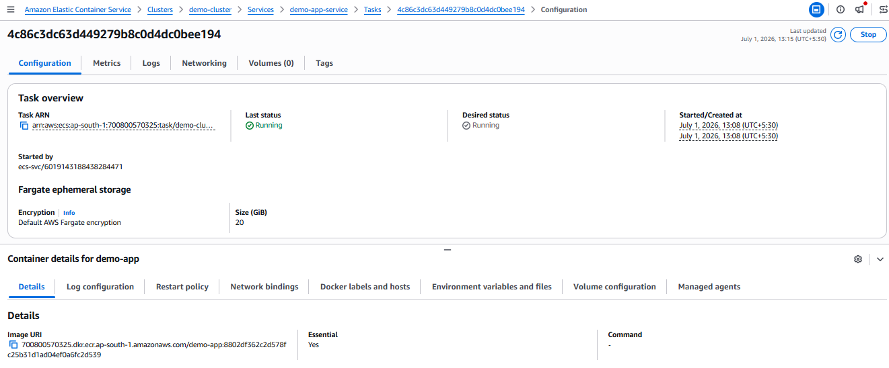

### ECS Task Logs — Flask app running
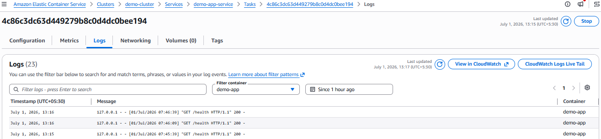

### ALB URL tested — app responding
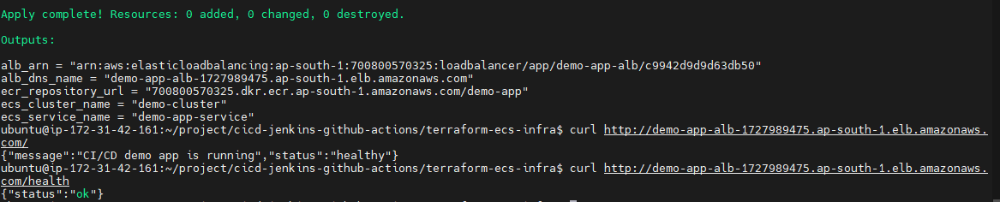

## Key Design Decisions

- **`lifecycle { ignore_changes = [task_definition] }`** on ECS service: Terraform creates the service, CI/CD owns the image — prevents `terraform apply` from rolling back deployments
- **OIDC-ready**: the GitHub Actions workflow is structured to switch from access keys to OIDC role assumption with a one-line change
- **Trivy `--ignore-unfixed`**: only fails the build on CVEs that actually have a patch available — avoids blocking deployments on upstream-deferred CVEs like `perl-base`
- **ALB security group separation**: ECS tasks accept traffic only from the ALB SG — tasks are not directly reachable from the internet

## Cleanup

```bash
cd terraform-ecs-infra && terraform destroy
```
